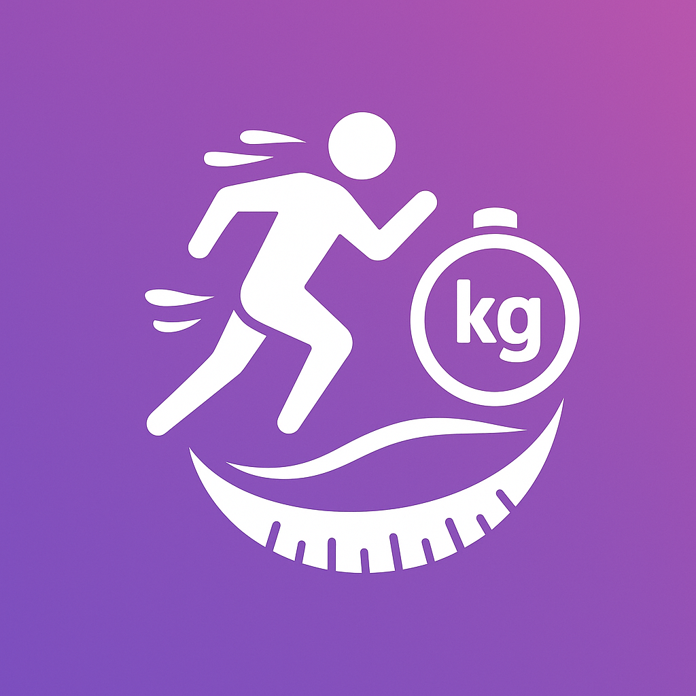
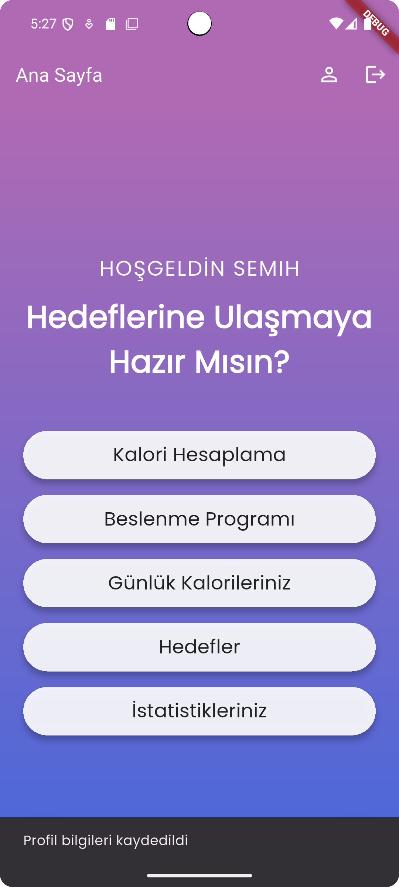
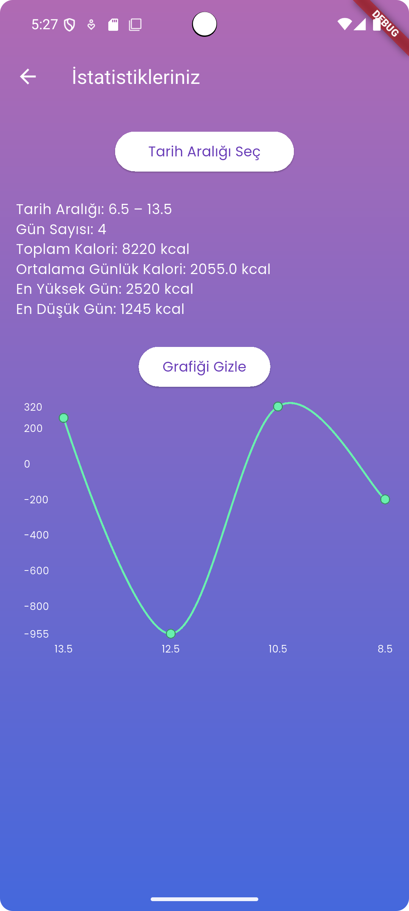
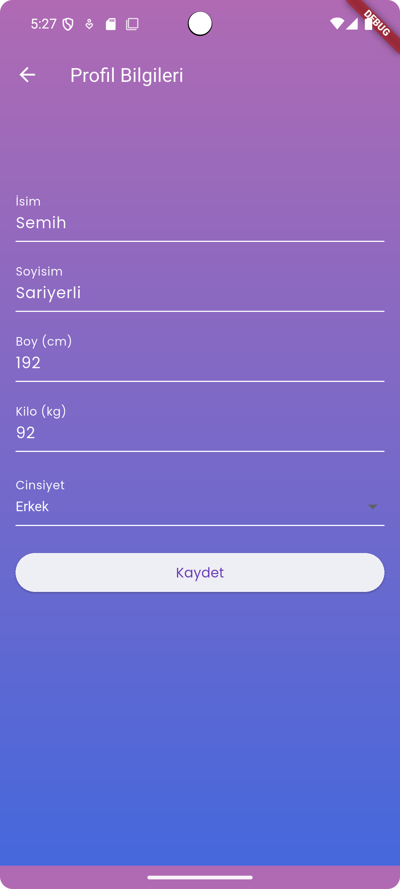

# 🥗 KaloriSel

KaloriSel, kişisel kalori takibi ve beslenme hedefleri yönetimi için geliştirilmiş modern ve kullanıcı dostu bir Flutter uygulamasıdır. Web üzerinden de erişilebilir.

 

---

## 🚀 Özellikler

- 🔢 Günlük kalori hesabı yapma
- 🥗 Kişiye özel beslenme programı
- 🎯 Hedef belirleme: Kilo vermek, korumak veya almak
- 📝 Günlük tüketim takibi
- 📊 Raporlama ve görselleştirme
- 👤 Profil oluşturma (isim, cinsiyet, boy, kilo)
- ☁️ Firebase Authentication ile güvenli giriş


---

## 🧱 Teknolojiler

| Teknoloji      | Açıklama                      |
|----------------|-------------------------------|
| Flutter        | Ana mobil/web framework       |
| Firebase Auth  | Kullanıcı girişi/sistemi      |
| SharedPreferences | Lokal veri saklama         |
| Netlify        | Web host (statik deploy)      |

---

## 🖼️ Ekran Görüntüleri

| Ana Sayfa | Kalori Hesaplama | Profil Sayfası |
|----------|------------------|----------------|
|  |  |  |


---

## 🛠️ Kurulum

## 🔐 Gizli Anahtarlar ve Yapılandırmalar

Bu projeyi çalıştırmak için aşağıdaki dosyalar yerel olarak oluşturulmalı:

1. `android/app/google-services.json`  
   - Firebase Console üzerinden alınmalıdır.

2. (Opsiyonel) `lib/secrets.dart`  
   - API anahtarları bu dosyada tutulmalı.
   - `lib/secrets_example.dart` dosyasını kopyalayarak oluşturabilirsiniz.

**Not:** Bu dosyalar `.gitignore` ile korunduğu için GitHub’da yer almaz.


### Flutter ile lokal çalıştırmak için:

```bash
git clone https://github.com/kullaniciadi/kalorisel.git
cd kalorisel
flutter pub get
flutter run
